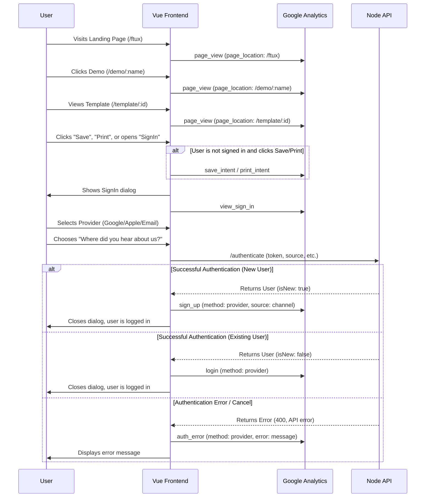

# Conversion Funnel Tracking

The conversion funnel from first session to account creation is tracked in Google Analytics 4 (GA4). The initial stages are captured via standard `page_view` events, while the final intent and registration steps use custom events.

## Event Sequence

## Events Breakdown

### 1. Awareness & Interest (Automatic Page Tracking)
These stages rely on GA4's default `page_view` event, filtering by `page_location`:
- **FTUX**: `/ftux`
- **Demo**: `/demo/:name` (e.g., `/demo/vfr_flight`)
- **Template View**: `/template/:id` (e.g., `/template/local`)

### 2. Consideration & Intent (Custom Events)
- **`save_intent`**: Triggered when an unauthenticated user tries to save.
- **`print_intent`**: Triggered when an unauthenticated user clicks print buttons.
- **`view_sign_in`**: Triggered when the `SignIn.vue` dialog opens.

### 3. Conversion (Custom Events)
- **`sign_up`**: Triggered when a *new* user account is successfully created. Includes `method` and `source` channel.
- **`login`**: Triggered when an *existing* user logs in. Includes `method`.
- **`auth_error`**: Triggered on authentication failure or cancellation.
